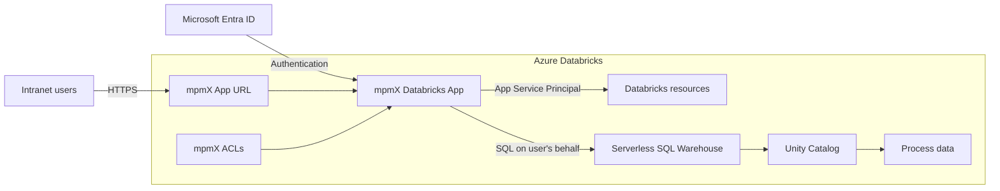
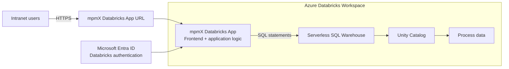

flowchart LR
subgraph NET["Réseau de l’entreprise"]
U["Utilisateurs internes"]
DNS["DNS Intranet mpmx.company.local"]

        subgraph VM["VM mpmX"]
            RP["Reverse Proxy HTTPS : 443"]
            FE["Frontend mpmX"]
            BE["Backend mpmX"]
        end

        U --> DNS
        DNS --> RP
        RP --> FE
        FE --> BE
    end

    subgraph AZ["Azure"]
        ENTRA["Microsoft Entra ID SSO utilisateurs"]

        subgraph DBX["Azure Databricks"]
            CON["Intégration native mpmX mécanisme à confirmer"]
            SQL["SQL Warehouse / Compute"]
            UC["Unity Catalog"]
            DATA["Tables et volumes"]
        end
    end

    FE -. Authentification .-> ENTRA
    BE -->|"HTTPS 443 Service Principal + OAuth"| CON
    CON --> SQL
    SQL --> UC
    UC --> DATA

# mpmX as a Databricks App

mpmX is deployed directly as a **Databricks App** from Databricks Marketplace. After installation, Databricks provides a dedicated application URL.

## Intranet requirements

- Publish the mpmX URL as a link in the company intranet.
- Users authenticate through Databricks using Microsoft Entra ID.
- To restrict access to the corporate network or VPN, configure:
  - Azure Databricks **Inbound Private Link**;
  - conditional DNS forwarding for `databricksapps.com`;
  - optionally, Databricks IP access lists.
- HTTPS is managed by the Databricks Apps platform.

## Databricks components

- **Databricks App:** hosts the mpmX interface and application logic.
- **Service Principal:** Databricks Apps creates a dedicated service principal for mpmX to access assigned Databricks resources. Permissions should follow least privilege.
- **Serverless SQL Warehouse:** mpmX uses it to execute SQL statements and Process Mining workloads. mpmX recommends `2X-Small` as the initial size, adjustable per scenario.
- **Unity Catalog:** governs access to catalogs, schemas, tables and the underlying process data.
- **User authorization:** when opening mpmX for the first time, users authorize the application to execute SQL on their behalf, preserving their Unity Catalog privileges.

## mpmX ACLs

mpmX adds application-level and scenario-level ACLs:

| Role              | ACL                      | Main permissions                                                               |
| ----------------- | ------------------------ | ------------------------------------------------------------------------------ |
| Application Admin | `CAN MANAGE` on app      | Manage the application, permissions and all scenarios                          |
| Process Admin     | `CAN MANAGE` on scenario | Configure and operate assigned scenarios                                       |
| Data Consumer     | `CAN USE` on scenario    | Read the computed process model without accessing the administration interface |

Permissions can be assigned to Databricks account groups, users and service principals.

## Sources

- [mpmX installation](https://help.mpmx.com/platform/databricks/installation_and_update)
- [mpmX security and ACLs](https://help.mpmx.com/platform/databricks/security)
- [Azure Databricks Apps networking](https://learn.microsoft.com/en-us/azure/databricks/dev-tools/databricks-apps/networking)

The VM hosts Qlik Sense Enterprise and the mpmX Qlik components: scripts, template apps and process-mining visualizations.
Users access the solution through the Qlik web interface over the intranet. There is no separate mpmX frontend.
Qlik connects to a Databricks SQL Warehouse using the native Databricks connector, based on ODBC over HTTPS.
Authentication should use a dedicated OAuth service principal.
Required permissions:
CAN USE on the SQL Warehouse
USE CATALOG
USE SCHEMA
SELECT on the required event-log tables or views
Qlik loads the event data from Databricks. mpmX then generates process variants, lead times, conformance, rework and root-cause metrics inside the Qlik application.
Network requirements: intranet access to the Qlik VM and outbound HTTPS 443 from the VM to the Databricks workspace.
